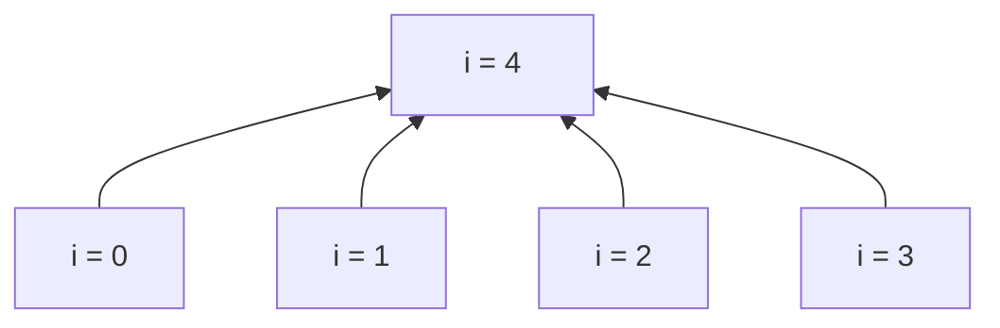

## Execution Contexts

Install [the mermaid-diagrams Chrome extension](https://chrome.google.com/webstore/detail/mermaid-diagrams/phfcghedmopjadpojhmmaffjmfiakfil) to view this diagram.

```mermaid
graph BT
    global["#nbsp;#nbsp;i = 4#nbsp;#nbsp;"]
    iter0[i = 0]-->global
    iter1[i = 1]-->global
    iter2[i = 2]-->global
    iter3[i = 3]-->global
```
